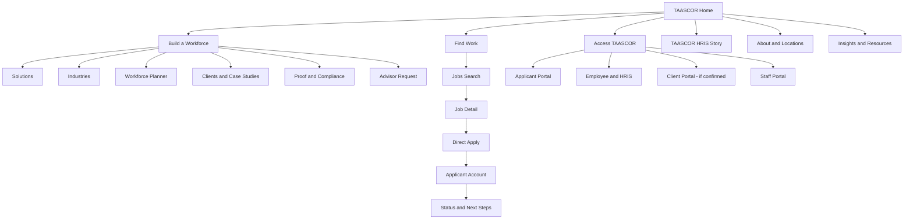

# TAASCOR Website Integrated Experience and Product Delivery Plan

**Prepared:** 1 September 2026
**Scope:** `C:\Users\mAOskii\Documents\TAASCOR Website`, [GitHub repository](https://github.com/maoskii08/TAASCOR-Website), and the public capabilities visible at [taascor.onrender.com](https://taascor.onrender.com/)
**Plan status:** Planning artifact only. No source implementation, Git initialization, commit, push, production mutation, or deployment is authorized by this plan.

## Executive decision

**Gate: PROCEED with source recovery, product discovery, and local design; NO-GO for feature implementation or release until the P0/P1 gates below are closed.**

TAASCOR should not copy the Render website into the cinematic page. It should absorb the useful capabilities into a governed product with three unmistakable entry points:

1. **Build a Workforce** — employer solutions, operating proof, a workforce-planning brief, and advisor conversion.
2. **Find Work** — searchable jobs, accessible job details, direct application, and an applicant journey.
3. **Access TAASCOR** — clear handoffs for Applicant, Employee/HRIS, Client, and authorized Staff roles.

The existing local site should remain the expressive public front door. Its particle workforce, service choreography, operating-floor visualization, Philippine coverage sequence, and restrained industrial brand language are the experience assets to protect. The recruitment and identity features should become purpose-built routes and secure application surfaces, not additional logic inside the current 67 KB single-file scroll film.

The unifying narrative object is **The TAASCOR Workforce Network**: people enter as potential, move through verified stages, form deployable teams, connect to client sites, and remain supported by an operating system. Motion must explain that lifecycle. It must never delay a visitor from finding a job, requesting manpower, reading compliance evidence, or completing a form.

## Goal and deliverables

### Goal

Create one professional, immersive TAASCOR digital ecosystem that preserves the existing world-class visual experience while adding the publicly evidenced recruitment, client, company-profile, and account capabilities of the Render site—redesigned for accessibility, privacy, security, mobile use, search discovery, maintainability, and operational governance.

### Required deliverables

- A protected GitHub baseline for the current local cinematic site.
- A modular public website with employer, jobseeker, and portal journeys.
- A governed jobs catalogue with individual job pages, search/filtering, accurate active/closed states, and working application handoff.
- A mobile-first staged application experience with save/resume, privacy notices, document controls, and accessible validation.
- Applicant registration, authentication, application-status timeline, and only those orientation/medical features confirmed by business discovery.
- A verified client/proof library with permissions, lineage, and case-study structure.
- A structured company profile, services, leadership, locations, compliance evidence, privacy, accessibility, and anti-fraud information.
- A clear TAASCOR HRIS story and secure handoff without mixing HRIS/payroll data into public marketing visuals.
- Automated local/CI checks, a manual governed release path, and evidence-based acceptance gates.

## Evidence baseline

### GitHub and local project

The [GitHub repository](https://github.com/maoskii08/TAASCOR-Website) is public but empty: it has no commit, branch ref, tree, release, deployment, or source file. GitHub therefore cannot yet serve as the source of truth.

The current local project is the only source artifact:

| Artifact | Current role | Evidence |
| --- | --- | --- |
| `index.html` | Entire public experience: markup, styles, content, canvas, and motion runtime | 1,288 lines; 67,049 bytes; SHA-256 `4978AA7B96E716FA4DA588776B141ECCBB918477B7337D8C7316C9FA3EA50DFA` |
| `favicon.svg` | TAASCOR hexagonal mark | SHA-256 `967FA0BA93FC413EAE7E590784B1B91BC5C2D04D9F7F6C6ABF8D17A4906F56B9` |
| `.claude/launch.json` | Local Python preview on port 5177 | No production/build contract |
| `Audit/AUDIT_2026-09-01.md` | Full local audit and evidence record | Gate: NO-GO pending source-control and P1 remediation |

The local site is static HTML/CSS/vanilla JavaScript with CDN-loaded GSAP, ScrollTrigger, Lenis, and remote fonts. It has no backend, database, authentication, application form, CMS, tests, build system, analytics, or deployment definition.

### Public Render capability surface

Read-only public inspection found these reachable routes:

- `/` — recruitment-led home and company profile.
- `/jobs.php` — four public job cards.
- `/apply.php` — full employment application.
- `/clients.php` — 27 client/partner cards.
- `/login.php` — shared applicant/HR/admin login.
- `/applicant_register.php` — applicant registration.

No authenticated account was used and no form was submitted. Applicant status, orientation, medical requirements, and HR/admin functionality are mentioned in public copy but were not observable. They are discovery requirements, not confirmed features.

### Material Render findings

- The four visible listings are Fujifilm Production Operator, Lazada seasonal work with no role title, Multimix warehouse/packer/sorter/production work, and Sumiden Production Worker. Their deep links use job IDs `180002`, `150002`, `1`, and `60002` respectively.
- Four job cards link to `apply.php?job_id=...`, but every tested link loses the selected job and company. Manual company selection populates the role correctly, confirming a broken deep-link handoff rather than an absent dependency.
- Jobs have no search, filtering, sorting, pagination, or individual job-detail routes.
- The application contains 42 location-specific company choices and collects extensive data in one step: birth information, religion, family/spouse/parents, emergency contact, education, employment, character references, SSS/TIN/Pag-IBIG/PhilHealth identifiers, and a resume.
- At a true 390 x 844 viewport, the application page is 572 CSS pixels wide, horizontally overflows the viewport, uses text as small as 9 px, has controls roughly 21–23 px high, and collapses some inputs to 8–10 px. This is a functional mobile failure.
- The form requires middle name while first and last name are not required. It provides only a generic confidentiality sentence, not a complete collection-specific privacy notice.
- Public forms expose no visible CSRF token. Registration has no privacy/terms link and advertises a six-character minimum password. Server-side controls were not tested and must not be inferred.
- Public responses set `PHPSESSID` broadly, while the observed cookie lacks `Secure`, `HttpOnly`, and `SameSite` attributes. CSP, HSTS, nosniff, referrer, permissions, and framing protections were not observed.
- The production console emits Tailwind's warning that `cdn.tailwindcss.com` should not be used in production; the site relies on a runtime styling CDN rather than a compiled asset.
- The first Render cold start observed during inspection took approximately 26 seconds. Warm behavior and platform configuration were not benchmarked, so this is a watch item rather than a generalized uptime claim.
- Client cards contain logos, descriptions, and “Job Offers” labels disconnected from the four active jobs. Current permissions and accuracy must be re-established. At 390 px the page fits horizontally, but the literal 27-card stack is approximately 11,710 CSS pixels tall, supporting a filtered proof mosaic rather than a direct card-for-card port.
- Client/company/job names are not canonical: examples include Swhistler Steel/WHISTLER STEEL, Ohgitani/OGICO, First Sumiden/SUMIDEN, and SIIX Coxon/SIIX. Lazada has no role title; requirements vary between missing, abbreviated free text, and structured lists.
- `robots.txt` and `sitemap.xml` return 404. Pages largely share a generic title and lack observed canonical, social, and structured metadata.
- Mobile home layout is generally usable, but its menu button lacks an accessible name/expanded state and the theme control lacks pressed-state semantics. Login and registration fit at mobile width, but their visible field text is not programmatically associated with the inputs and autocomplete hints are absent.

These observations justify migrating capability and data—not copying templates, routes, security posture, or collection practices.

### Raw public content requiring owner validation

The Render source presents SEC registration `CS201212925`, D.O. 174 certificate claim `RO1VA-LPO DO174-1220-083-R`, six service lines, seven named leadership/management roles, an image-based organization chart, and seven offices/branches. None of those current-status facts should be treated as verified solely because they are published.

The 27 client/partner candidates are: First Sumiden, Ohgitani, Multimix, Lazada, Shopee, Cainiao, Leslie, Aboitiz Land, Bi-Chain, Fujifilm, SIIX Coxon, MTC-Transport, Prime Worldwide, Swhistler Steel, Centro, Cavite Light Industrial Park, Globalmaxx, Auto 88, Sealed Air, WCL Cold Storage, CYA, Delta Milling, Pasture to Plate, Euro-Med, Yuanshan, Maxistar, and Shinsei. Before public reuse, reconcile exact legal/display names, relationship state, logo rights, copy provenance, active-job relationships, and the approving owner.

## Feature truth and migration map

| Capability | Publicly evidenced? | Decision | Target behavior / release condition |
| --- | --- | --- | --- |
| Cinematic corporate home | Local only | **Retain and modularize** | Preserve the workforce-particle story, coverage, service choreography, operating-system visual, and premium brand language; core content remains visible without JS/motion. |
| About, vision, mission, values | Yes, but duplicated/inconsistent | **Consolidate** | One approved canonical version, with owners and effective date; use across home and About without divergence. |
| Six service lines | Yes on both sites | **Migrate and deepen** | Dedicated crawlable service pages with scope, responsibility split, process, proof, FAQs, and employer CTA. |
| Leadership and organization chart | Yes | **Migrate conditionally** | Publish only approved current names/roles and an accessible structure; do not use an image-only org chart. |
| Offices/branches | Yes | **Migrate after verification** | Structured location data, map/list switch, directions/contact CTA, hours/service area, and owner-approved current addresses. |
| Public jobs list | Yes | **Rebuild** | Search by keyword, location, worksite, function, shift, and employment type; accurate active/closing/closed state. |
| Individual job details | No | **Add** | One canonical readable route per job, full requirements and worksite, structured data, direct-apply CTA, scam warning, related jobs. |
| Job-to-application context | Present but broken | **Replace** | Signed/server-validated job identifier persists through apply and confirmation; no duplicate selection. |
| Employment application | Yes | **Redesign completely** | Responsive staged flow, save/resume, accessible labels/errors, privacy notice at collection, proportional data capture. |
| Resume/document upload | Yes | **Rebuild securely** | Allowlist extension and MIME, size limit, generated filenames, malware scanning, private storage, authorized signed retrieval, retention/deletion. |
| Client/partner library | Yes, 27 cards | **Curate** | Publish only approved logos/copy; filter by industry/capability; move meaningful proof into permissioned case studies. |
| Applicant registration/login | Yes | **Rebuild securely** | Email verification, safe recovery, rate limits, modern password/passkey direction, clear privacy notice, applicant-specific entry. |
| Applicant status tracking | Mentioned only | **Discover, then build** | Status timeline with defined states, owner, timestamps, candidate-facing language, and audit history. No inferred state machine. |
| Orientation/medical checklist | Mentioned only | **Discover, then build** | Conditional post-shortlist/pre-employment stage; only approved minimum data; role-based visibility and retention. |
| HR/admin back office | Login copy only | **Do not claim yet** | Inventory the actual source, roles, screens, workflows, and audit requirements before scoping migration. |
| Theme toggle/mobile navigation | Yes | **Retain and correct** | Accessible theme control and navigation disclosure with persisted preference, keyboard behavior, and sufficient contrast. |
| TAASCOR HRIS handoff | Local outbound link | **Retain and elevate** | Dedicated platform story plus clear Employee/HRIS portal action. Authenticate only in the governed HRIS surface. |
| Employer lead capture | Email/phone only | **Expand** | Workforce Planner and Advisor request, with transparent response expectations and CRM/owner routing only after approval. |
| Compliance proof | Present but risky | **Evidence-gate** | Current certificate, entity match, region, issue/expiry dates, approved copy, and verification link before displaying current-status claims. |
| Generic PHP route names/developer credit | Yes | **Retire** | Human-readable canonical routes and TAASCOR-owned footer/legal information. |

## Product strategy

### Three doors, one operating system

The first navigation decision must be audience-based, not an internal organizational chart:

| Door | Primary visitor intent | First success moment | Primary conversion |
| --- | --- | --- | --- |
| **Build a Workforce** | “Can TAASCOR solve this workforce need credibly?” | Visitor sees relevant industry/service, responsibility split, deployment process, and verified proof | Submit a structured staffing brief or book an advisor conversation |
| **Find Work** | “What suitable, legitimate jobs are open and how quickly can I apply?” | Visitor reaches a readable matching job with clear requirements, worksite, and hiring process | Complete a short first-stage application |
| **Access TAASCOR** | “I already have a relationship and need my workspace.” | User selects the correct, clearly labeled role surface | Authenticate in Applicant, Employee/HRIS, Client, or Staff portal |

### Experience principles

1. **Cinematic at the top, frictionless at the task.** The home may feel like a film; job search and forms must feel like excellent software.
2. **Purposeful motion.** Every transformation represents screening, formation, deployment, coverage, or support. Decorative motion never competes with a task.
3. **Proof before superlative.** Metrics, client outcomes, registrations, certifications, and “in production” claims require an owner, source, effective date, and review date.
4. **People before paperwork.** Ask for the smallest information needed at the current recruitment stage.
5. **Two conversion ladders.** Employers and candidates receive different next steps, language, success measures, and follow-up ownership.
6. **Progressive enhancement.** Navigation, positioning, jobs, trust, and contact remain usable when scripts, fonts, canvas, or motion fail.
7. **Mobile is a first-class product.** Application completion, authentication, document upload, and status checking are designed from 360–390 px upward.
8. **One source for dynamic truth.** Jobs, clients, locations, claims, application states, and notice versions cannot drift across duplicate hardcoded pages.

## Recommended information architecture



### Proposed public route map

- `/` — cinematic home and audience routing.
- `/solutions` and `/solutions/{service}` — service catalogue and individual solution pages.
- `/industries` and `/industries/{industry}` — industry context, constraints, relevant services, proof.
- `/platform` and `/platform/{module}` — TAASCOR HRIS lifecycle and module tours.
- `/jobs` — search/filter and saved-search entry.
- `/jobs/{job-slug}` — canonical job detail and `JobPosting` metadata.
- `/apply/{job-slug}` — direct, staged application retaining job context.
- `/clients` and `/case-studies/{slug}` — permissioned proof.
- `/proof` — trust, compliance, security, privacy, worker grievance, and anti-fraud hub.
- `/about`, `/leadership`, `/locations`, `/contact` — corporate information and conversion.
- `/insights` and `/resources/{slug}` — source-backed workforce guidance.
- `/login` — role selector only; it must not place every role into one ambiguous form.
- `/applicant/*` — applicant account and status.
- `/staff/*` — separately protected staff workspace.
- `/privacy`, `/terms`, `/accessibility`, `/recruitment-privacy`, `/report-fraud` — governed legal/support routes.

Client and Employee/HRIS routes may remain external if those products have different authentication and release lifecycles. The public shell should make the transition explicit and trustworthy.

## Creative direction: The TAASCOR Workforce Network

### Narrative object

The persistent visual object is a field of people-nodes moving through a governed workforce lifecycle. In the current local site it already becomes a pool, funnel, hexagon, network, Philippine coverage map, and orbit. The redesign should make those states semantically consistent across every scene and reuse the object only where it adds meaning.

### Seven-scene home experience

| Scene | Narrative and content | Interaction and motion | Static/reduced-motion experience | Conversion role |
| --- | --- | --- | --- | --- |
| **1. Potential** | TAASCOR turns workforce complexity into deployable capability. | People-nodes enter the field and organize around a restrained hexagonal operating core. | Strong headline, proof qualifier, three audience doors visible immediately. | Split employer, jobseeker, and portal traffic without scrolling. |
| **2. Choose the mission** | “Build a Workforce” and “Find Work” are equal but distinct journeys. | The field divides into two purposeful streams; hover/focus previews the next route without hijacking scroll. | Two high-contrast cards with precise outcomes and native links. | Correct audience routing. |
| **3. Formation engine** | Six service lines and the responsibility split between TAASCOR and the client. | Existing horizontal service choreography becomes a controlled formation line; each module expands on demand. | Stacked service summaries with independent pages. | Employer exploration and capability-profile CTA. |
| **4. Opportunity network** | Current jobs, locations, hiring channels, and anti-fraud guidance. | Nodes become live opportunity markers on an abstracted Philippine network; only active jobs illuminate. | Search preview with current job cards and “View all jobs.” | Job discovery and direct apply. |
| **5. Operate and support** | Attract → Screen → Onboard → Deploy → Time/Payroll → Employee Support → Insight. | The existing operations floor and HRIS sequence become a chaptered lifecycle with sanitized real interface states. | Linear steps, text, and still UI previews. | HRIS tour and advisor request. |
| **6. Proof ledger** | Current compliance, approved clients, locations, case studies, security/privacy commitments. | Client and proof nodes resolve into a calm evidence grid; no ornamental counter masquerades as a live KPI. | Dated cards, document links, permissioned logos, and explicit gaps. | Reduce buyer and candidate risk. |
| **7. Convergence** | Employer brief, job search, and account access remain available at the close. | Streams reconnect around three stable calls to action; motion settles rather than ending in visual noise. | Contact/portal details and native actions. | Final conversion with no dead end. |

### Visual system

- Preserve the local navy, crimson, gold, graphite, and ivory brand family, but promote the existing CSS variables into versioned design tokens.
- Keep Archivo/Switzer-style editorial contrast and IBM Plex Mono-style operational labels, while self-hosting or bundling approved font assets where licensing permits.
- Use a 12-column desktop grid, deliberately asymmetric editorial compositions, generous dark negative space, and consistent content widths.
- Add original, permissioned Filipino workforce and facility photography. Avoid generic stock “office handshake” imagery and fabricated worker scenes.
- Use sanitized real HRIS/product states for platform storytelling. Illustrations remain explicitly illustrative and separate from live data.
- Use crimson for action/formation, gold for proof/verified state, green only for true operational success, and neutral amber for pending/review.
- Retain subtle industrial textures, coordinate lines, and hexagonal geometry; reduce the number of simultaneous effects.

### Motion grammar

- **Enter:** dispersed nodes become legible structure.
- **Screen:** noisy signals narrow through a clear gate.
- **Form:** individuals lock into a team/capability unit.
- **Deploy:** the unit travels to a location or client context.
- **Support:** stable orbit or pulse denotes an active governed relationship.
- **Verify:** evidence resolves sharply and motion pauses.

Motion must use transforms/opacity where possible, pause when offscreen, reduce particle count on coarse/low-power devices, provide a motion control where continuous movement exceeds five seconds, and fully honor `prefers-reduced-motion`.

## Page-level experience specification

### Home

- Immediate three-door routing; no audience waits through a long film.
- Existing workforce formation and operations imagery retained as the premium narrative layer.
- Live jobs preview sourced from the same job records as `/jobs`.
- Proof cards show only verified, dated facts; illustrative KPIs stay labeled illustrative.
- Sticky navigation contains Solutions, Industries, Platform, Jobs, Proof, About, plus audience CTAs.

### Jobs

- Mobile-first search with keyword, location/worksite, function, shift, and employment type filters.
- Result count, applied filters, clear reset, sortable recent/relevant modes, accessible empty state, and shareable query URLs.
- Cards expose title, company/worksite, location, type, posted/closing date, essential requirements, and status.
- Closed jobs remain available only when useful, clearly marked and removed from active structured data.
- Saved search/job alerts are optional and require separate consent and unsubscribe controls.

### Job detail

- Human-readable canonical route, unique title/description, breadcrumbs, and accurate `JobPosting` structured data.
- Role purpose, responsibilities, qualifications, worksite, schedule/shift, employment type, hiring process, documents needed now versus later, and anti-scam notice.
- Direct Apply carries a server-validated job ID; applicant never chooses the same company/role again.
- Related jobs use the canonical data model, not client-card labels.

### Apply

Replace the A4-style form with a responsive stepper:

1. **Intent:** selected job, first/last name, email or mobile, preferred contact, location/work eligibility, collection-specific privacy notice.
2. **Fit:** essential screening questions tied to the job; resume optional where an accessible manual-entry route is available.
3. **Experience:** education and employment only to the level needed for screening; save/resume.
4. **Review:** plain-language summary, editable sections, certification of accuracy, and consent/acknowledgment kept legally distinct.
5. **Confirmation:** reference number, next step, expected response window, official contact channel, account creation/sign-in option.
6. **Conditional later stage:** statutory IDs, medical information, family/dependent data, and other sensitive records only after an approved trigger, with purpose, lawful basis, visibility, retention, and deletion documented.

Religion, family details, and government identifiers must not be copied into the first-touch form merely because the legacy page contains them. The Philippine Data Privacy Act requires transparency, legitimate purpose, proportionality, data minimization, and retention limits; the collection design requires TAASCOR DPO/legal approval. See the [Data Privacy Act](https://privacy.gov.ph/data-privacy-act/) and the NPC’s [right-to-be-informed guidance](https://privacy.gov.ph/the-right-to-be-informed/).

### Applicant account

- Explicit Applicant login and registration, email/phone verification, safe password recovery, rate limiting, and enumeration-resistant responses.
- Dashboard contains application cards, a status timeline, requests for action, document checklist, messages/notifications, and privacy/account controls.
- Candidate-facing status labels must be mapped to internal statuses and defined before implementation.
- Orientation and medical items appear only when legitimately required and assigned; they are not generic profile fields.
- The applicant can view privacy notice version, consents/acknowledgments, retained documents, and a data-subject request route.

### Clients and proof

- Import the 27 public client candidates into a private review register first—not straight into production.
- For each: legal display name, logo permission, relationship status, approved description, relevant capability, dates, proof owner, and allowed public usage.
- Replace disconnected “Job Offers” tags with live relationships to active job records.
- Turn the strongest approved relationships into case studies with scope, baseline, method, dated result, and client approval. Do not invent metrics to fill gaps.

### Platform / TAASCOR HRIS

- Present one connected lifecycle: Attract → Screen → Onboard → Time/Schedule → Payroll → Employee Self-Service → Analytics/Compliance.
- Add role views for HR, manager, employee, and client only where those capabilities are real.
- Use an ungated 90–150 second overview, chaptered module tours, and a live-demo/advisor CTA.
- Distinguish “TAASCOR-managed services powered by the platform” from a standalone software subscription unless the commercial model explicitly supports both.
- Keep employee, payroll, attendance, and client data out of the public marketing runtime. Use approved sanitized captures or synthetic fixtures only.

### Proof and Compliance Center

- Current DOLE registration: legal entity, order, certificate number, issuing region, issue/expiry date, and official verification route.
- SEC/entity details and current locations.
- Approved client proofs and case-study methodology.
- Recruitment Privacy Notice, general Privacy Notice, DPO/data-subject contact, retention overview, and subprocessors where applicable.
- Security overview: role access, encryption, backup/recovery, incident contact, and dated certifications only when evidenced.
- Worker grievance/reporting route, anti-fraud hiring guidance, terms, and accessibility statement.

DOLE states that D.O. 174 superseded D.O. 18-A and governs the current registration framework. The existing local copy must not present the old D.O. 18-A credential as current. Obtain the current certificate and official match before publication. See [DOLE’s announcement](https://dole.gov.ph/news/bello-signs-d-o-on-contracting-and-subcontracting/), [registration guidance](https://ble.dole.gov.ph/registration-of-job-contractor/), and the [official D.O. 174 text](https://www.ble.dole.gov.ph/wp-content/uploads/2023/02/DO-174-17-Rules-Implementing-Articles-106-to-109-of-the-Labor-Code-As-Amended1.pdf). This is a verification requirement, not a legal conclusion.

## Recommended technical architecture

### Recommendation: governed modular monolith, two experience surfaces

Use one GitHub repository and one primary application boundary, but keep the public experience and authenticated portal visually and operationally distinct:

1. **Public experience:** server-rendered, crawlable pages using componentized templates, Vite-bundled TypeScript/CSS, and isolated GSAP/Lenis experience modules. Static DOM content loads before enhancement.
2. **Secure recruitment portal:** framework-managed routing, database, authentication, authorization, validation, uploads, audit events, mail/notification jobs, and staff workflows.

Because the observed recruitment site is PHP-based and the stated deployment practice targets Hostinger, the leading implementation option is a supported **Laravel + Blade/component + Vite** stack, with small TypeScript/JavaScript experience islands. It offers server-rendered SEO, CSRF/session protections, validation, queues, database migrations, and authorization without forcing the marketing experience into a large client-side application. Confirm the supported PHP/database/queue/runtime versions and exact Hostinger deployment path before locking this choice.

If TAASCOR has a separately managed API or a Node-capable hosting target, an Astro public application plus a secured recruitment API is a valid alternative. Do not choose it merely for novelty: it introduces another runtime, deployable, and contract boundary. The architecture decision gate should compare source availability, team capability, hosting support, authentication ownership, job-update frequency, and release/rollback complexity.

### Proposed repository shape

```text
TAASCOR-Website/
  app/
    Domains/
      Content/
      Jobs/
      Applications/
      Applicants/
      Clients/
      Compliance/
    Http/
    Policies/
  config/
  database/
    migrations/
    seeders/
  docs/
    architecture/
    content-claims/
    privacy/
    release/
  public/
  resources/
    content/
    css/
    js/
      experience/
      forms/
    views/
      public/
      applicant/
      staff/
      components/
  routes/
  tests/
    Feature/
    Unit/
    Browser/
  .env.example
  README.md
```

This is a target structure, not permission to replace the existing page. The cinematic page should first be preserved at an auditable baseline, then decomposed behind visual-regression tests.

### Core data domains

- **Content:** services, industries, offices, leadership, pages, navigation, media, SEO fields.
- **Claims:** claim text, source/evidence, owner, approval, effective/review/expiry date, surface, status.
- **Clients/proof:** approved display identity, logo rights, descriptions, relationship state, case studies.
- **Jobs:** title, slug, worksite/company/location, function, shift, employment type, description, requirements, openings, posted/closing dates, publication state, structured-data fields.
- **Applicants:** account/contact identity separated from high-risk profile data where practical.
- **Applications:** job snapshot, stage, answers, status history, assigned owner, timestamps, withdrawal/rejection reason taxonomy.
- **Documents:** private object metadata, type, owner, scan state, retention date, authorized access events.
- **Privacy:** notice versions, purpose/lawful-basis map, acknowledgments/consents, retention rules, data-subject requests.
- **Orientation/medical:** conditional workflow objects, not universal applicant fields.
- **Audit:** actor, action, target, before/after or event payload, timestamp, and reason where identity/status/data is affected.

### Integration boundaries

- Jobs API/data access is the single source for home previews, jobs search, job detail, client relationships, and structured data.
- HRIS remains a separate governed system unless its owner approves an explicit API contract. Public pages receive no live employee/payroll dataset.
- Email/SMS notifications require approved provider, templates, opt-in/transactional classification, retry policy, delivery logs, and redaction rules.
- Document storage must be private and outside directly executable/public web paths; downloads require authorization and short-lived access.
- Any CRM, scheduling, maps, analytics, or chat integration receives its own privacy/security/vendor approval and failure fallback.
- An `.env.example` must contain variable names and safe blank values only. Real credentials never enter Git.

## Security, privacy, and trust controls

### Minimum release controls

- CSRF protection on every state-changing browser request.
- Secure, `HttpOnly`, appropriately scoped `SameSite` session cookies; rotation on authentication; absolute and idle expiry.
- Explicit role-based authorization for Applicant, Recruiter, HR, Admin, Client, and Employee surfaces; deny by default.
- Staff MFA, protected password recovery, email verification where appropriate, rate limits, lockout/abuse monitoring, and account enumeration resistance.
- Server-side validation independent of browser constraints; safe normalization and output encoding.
- File allowlist by extension and MIME/signature, bounded size, generated name, malware scan/quarantine, private storage, and authorized download.
- Encryption in transit and at rest appropriate to the data; secrets outside source; key/credential rotation process.
- Security headers including CSP, HSTS after HTTPS confirmation, nosniff, Referrer-Policy, Permissions-Policy, and anti-framing controls.
- Privacy and security logs that avoid raw resumes, government IDs, medical information, passwords, tokens, or unnecessary contact data.
- Tested backup/restore, retention/deletion jobs, incident escalation, and applicant data-subject request handling.
- Dependency inventory and supported-version policy; no production Tailwind CDN or unsigned runtime CDN dependency.

OWASP recommends CSRF protection for cookie-authenticated applications and specific controls for file uploads, including allowlisting, safe naming/storage, size limits, authorization, and malicious-file protections. See the [CSRF Prevention Cheat Sheet](https://cheatsheetseries.owasp.org/cheatsheets/Cross-Site_Request_Forgery_Prevention_Cheat_Sheet.html) and [File Upload Cheat Sheet](https://cheatsheetseries.owasp.org/cheatsheets/File_Upload_Cheat_Sheet.html).

### Privacy design deliverables

- Data inventory and field-by-field necessity decision.
- Purpose, lawful basis, recipients, access roles, retention, deletion, and evidence owner for every category.
- Separate privacy notice from consent; separate optional marketing consent from recruitment processing.
- Privacy impact assessment before sensitive recruitment/medical/statutory processing launches.
- DPO/legal sign-off on collection notices and retention rules.
- Vendor/subprocessor register and approved data-processing agreements where applicable.
- Applicant access/correction/withdrawal/deletion request workflow, subject to applicable legal retention requirements.

## SEO, discoverability, and content governance

- Confirm one canonical production domain. Redirect controlled legacy domains and remove or correct stale D.O. 18-A pages where TAASCOR has authority.
- Provide unique page titles/descriptions, canonical links, Open Graph/social cards, breadcrumbs, XML sitemap, and deliberate robots policy.
- Add accurate `Organization` data and `JobPosting` data on each readable individual job page. Google says job structured data belongs on a single job page, should be validated, and closed jobs must be kept current. See [Google’s JobPosting documentation](https://developers.google.com/search/docs/appearance/structured-data/job-posting).
- Maintain an editorial/claim register with owner, evidence, approval, effective date, review date, and expiry where applicable.
- Publish source-backed Philippine workforce resources reviewed by a named operational/compliance expert. Do not produce generic volume content.
- Add anti-fraud hiring guidance with official channels, fee policy, and reporting contacts.
- Create a media-rights register for logos, worker photography, facilities, leadership images, interface captures, and testimonials.

## Accessibility and performance contract

### Accessibility target

Target **WCAG 2.2 AA**, including:

- Semantic header/nav/main/footer landmarks and a visible-on-focus skip link.
- Logical focus order, visible focus, no control inside `aria-hidden`, and no focused element hidden by sticky content.
- Accessible menu/theme states, native controls where possible, descriptive labels, error summary plus inline errors, and status announcements.
- Meaningful headings, breadcrumbs, instructions, autocomplete tokens, accessible file upload, and no table-layout form.
- Design target of at least 44 x 44 CSS pixels for touch controls; never fall below the applicable WCAG target-size requirement.
- Captions/transcripts for video, alt text or decorative treatment for images, and accessible sanitized UI tours.
- Full reduced-motion mode, pause/stop for persistent automatic movement, no scroll-jacking, and task completion without motion.

WCAG 2.2 adds requirements including focus not obscured, target size, redundant entry, and accessible authentication. See the [W3C WCAG 2.2 Recommendation](https://www.w3.org/TR/WCAG22/).

### Performance target

At the 75th percentile of field data, target:

- LCP at or below 2.5 seconds.
- INP at or below 200 milliseconds.
- CLS at or below 0.1.

These are the current “good” Core Web Vitals thresholds documented by [web.dev](https://web.dev/articles/defining-core-web-vitals-thresholds). Establish provisional lab budgets during the prototype: initial public-route JavaScript, critical CSS, font payload, hero media, and CPU time on a representative mid/low-tier phone. Lazy-load noncritical media and portal code, pause canvas offscreen, reserve layout space, use responsive AVIF/WebP, and test a no-CDN/no-JS failure path.

## Measurement framework

Do not use page views as the primary success claim. Track privacy-aware outcomes with clear denominators:

| Journey | Primary measure | Guardrails |
| --- | --- | --- |
| Employer | Qualified staffing briefs / completed advisor requests | Spam rate, response SLA, evidence completeness, accessibility defects |
| Jobs | Job-detail-to-stage-one-application completion | Duplicate submissions, context-loss defects, form error rate, mobile abandonment |
| Applicant | Applications reaching a defined next step | Status age, unresolved applicant action, notification failures, privacy requests |
| HRIS | Tour-to-qualified-demo intent | Unsupported claim count, performance, portal misrouting |
| Experience | Core Web Vitals and task success by device | Reduced-motion success, keyboard completion, error-free sessions |

Every metric needs event definition, population, denominator, exclusions, owner, retention, and environment. Illustrative homepage KPIs remain visually and technically separate from analytics or client data.

## Execution plan

### Phase 0 — Protect the baseline and recover the real system

**Outcome:** A trustworthy starting point and a complete evidence inventory.

**Work**

- Preserve the current local files and hashes; create a rollback copy before restructuring.
- With explicit approval, initialize/clone the empty GitHub repository, add the exact reviewed local baseline, and create the first commit. Do not mix remediations into the baseline commit.
- Obtain the Render application source, database/schema export, migration history, uploaded-asset inventory, environment-variable names, mail/storage dependencies, and deployment/runbook—or formally classify the Render site as reference-only.
- Identify owners for jobs, client proof, corporate copy, compliance, privacy, recruitment workflow, HRIS, infrastructure, and release approval.
- Confirm the canonical production domain, Hostinger runtime/path, database option, mail/queue/cron capabilities, SSL, backup, and rollback mechanism.

**Dependencies:** GitHub access/approval; Render source owner; production/hosting owner.

**Verification:** baseline file hashes match; Git remote/branch/commit resolve; source and data inventory signed off; secrets excluded; production remains untouched.

**Approval gate G0:** Product/engineering owner accepts the baseline and declares whether Render code is migratable or reference-only.

### Phase 1 — Product, content, compliance, and privacy discovery

**Outcome:** A signed feature scope and content/data contract.

**Work**

- Interview employer, recruitment, applicant-support, payroll/HRIS, compliance, DPO, and release owners.
- Define the three audience journeys, internal handoffs, service responsibility split, and primary conversion for each.
- Inventory every Render field, account action, status, notification, document, staff role, and admin workflow from source and stakeholder evidence.
- Reconcile one vision, mission, values, service taxonomy, leadership list, office list, client register, and job/company/location taxonomy.
- Build the claim register; verify the current DOLE certificate and whether recruitment/placement wording needs a separate authority review.
- Build the privacy data map, retention schedule, notice outline, consent/acknowledgment distinctions, and applicant-stage collection model.
- Approve what is explicitly out of scope for release one.

**Dependencies:** Phase 0 evidence; operational and legal owners.

**Verification:** journey maps and backlog trace to an owner; every sensitive field has a decision; all public claims are verified, qualified, removed, or visibly marked pending.

**Approval gate G1:** Product, Recruitment, Compliance/Legal, and DPO approve the scope, data map, claims, and target journeys.

### Phase 2 — Experience prototype and architecture foundation

**Outcome:** Tested design direction and maintainable project skeleton.

**Work**

- Produce responsive high-fidelity prototypes for the home’s seven scenes, jobs search/detail, staged apply, applicant dashboard, proof center, and portal selector.
- Test prototypes with employer, jobseeker, recruiter, keyboard-only, and reduced-motion scenarios.
- Complete the Laravel versus Astro/API architecture decision against hosting and ownership evidence.
- Establish project structure, design tokens, components, route conventions, content model, migrations, `.env.example`, local setup, and test harness.
- Bundle versioned dependencies; create static/no-JS fallback before porting motion.
- Define API and event contracts, role matrix, status state machine, error taxonomy, and observability/redaction rules.

**Dependencies:** G1; confirmed hosting/runtime; technical owner.

**Verification:** prototype task testing; architecture decision record; local fresh-setup test; threat model; schema review; accessibility annotations.

**Approval gate G2:** Design, Product, Engineering, Security/DPO, and hosting owner approve the prototype and architecture.

### Phase 3 — Restore and harden the immersive public shell

**Outcome:** The existing world-class experience survives modularization and failure conditions.

**Work**

- Port the current page into components without changing its approved visual baseline.
- Extract brand tokens, layout, content, canvas/motion engine, scenes, controls, and route shell.
- Fix hidden focusable industry controls, add main/skip/top targets, guard animation initialization, and expose content when dependencies fail.
- Implement the three-door navigation, reduced-motion scene treatment, motion pause/offscreen behavior, and accessible mobile menu/theme controls.
- Add visual-regression captures at agreed desktop/tablet/phone sizes and baseline the current film.

**Dependencies:** G2 foundation and baseline screenshots.

**Verification:** visual diff within approved tolerance; keyboard/reduced-motion/no-JS/CDN-failure checks; no horizontal overflow; performance prototype on representative phones.

**Approval gate G3:** Creative/product owner accepts visual continuity; accessibility owner accepts interaction foundations.

### Phase 4 — Public content, proof, jobs, and employer conversion

**Outcome:** All public Render capabilities are available in a materially better, governed form.

**Work**

- Build About, Solutions, Industries, HRIS, Locations, Clients/Case Studies, Proof, Contact, Privacy, Accessibility, and anti-fraud routes.
- Build job management/publication, search/filter, job details, active/closed handling, related jobs, and working apply context.
- Add client permission workflow and live job relationships; remove stale/disconnected job tags.
- Build the employer conversion ladder: capability exploration, governed Workforce Planner, and Advisor Request.
- Add canonical/social metadata, sitemap/robots, breadcrumbs, Organization/JobPosting data, and content preview/approval.

**Dependencies:** approved content/claims; job owner; media rights; G3 shell.

**Verification:** route/content/link tests; structured-data validation; job publish/close/index lifecycle; employer brief routing; client/logo approval reconciliation.

**Approval gate G4:** Marketing, Recruitment, Compliance, and content owners approve every public surface.

### Phase 5 — Applicant journey and governed document handling

**Outcome:** A secure, accessible, mobile-first candidate product.

**Work**

- Implement staged direct apply, save/resume, review, confirmation, and reference number.
- Implement Applicant registration/login/verification/recovery and account/privacy controls.
- Implement the approved application status timeline, action requests, notifications, and staff ownership.
- Implement private document upload/access/scanning/retention.
- Add orientation/medical workflows only when their trigger, data, owner, notice, and access rules are approved.
- Migrate candidate/application data only through a separately approved, rehearsed, reconciled plan.

**Dependencies:** G1 data decisions; G2 security architecture; actual Render schema/data access if migration is required.

**Verification:** feature/authorization tests; mobile completion; keyboard/screen-reader completion; upload abuse tests; privacy notice/version records; backup/restore and deletion jobs; migration dry run and reconciliation.

**Approval gate G5:** Recruitment, Security, DPO/Legal, and data owner authorize production-readiness testing. This is not authorization to migrate live data.

### Phase 6 — Staff workflows, portals, and integrations

**Outcome:** Confirmed internal capabilities support the applicant journey without ambiguous access.

**Work**

- Implement only source-verified recruiter/HR/admin workflows, permissions, queues, search, notes, assignments, and audit events.
- Separate staff authentication from Applicant login and clarify Client/Employee/HRIS handoffs.
- Integrate approved email/SMS/calendar/CRM/HRIS services through documented contracts and failure queues.
- Add operational dashboards using defined source-backed metrics; never reuse illustrative homepage KPIs as live data.

**Dependencies:** authenticated legacy discovery; role/approval matrix; vendor approval.

**Verification:** role matrix and negative authorization tests; audit-log review; notification retry/failure tests; reconciliation with operational owners.

**Approval gate G6:** Each system owner signs off its workflow, roles, metrics, and handoff.

### Phase 7 — Cross-functional release qualification

**Outcome:** A commit-specific release candidate with evidence.

**Work**

- Run unit, feature, browser, database, migration, security, accessibility, visual, responsive, performance, SEO, link, content, and failure-path suites.
- Conduct recruitment/business UAT with test records in a non-production environment.
- Complete privacy/security review, penetration testing appropriate to the data risk, backup/restore rehearsal, and incident/rollback drill.
- Verify hashes from exact commit to build/package; create a release manifest and known-gap register.

**Dependencies:** G4–G6.

**Verification:** all P0/P1 issues closed; P2 items explicitly accepted/owned; release candidate tied to an exact Git commit; no real production test data.

**Approval gate G7:** Release, Business, Security, DPO/Legal, and Product approve the exact release candidate.

### Phase 8 — Governed release and live validation

**Outcome:** Controlled production launch with rollback evidence.

**Work**

1. Commit reviewed explicit paths and push to GitHub.
2. Build/package the verified exact commit.
3. Back up the named production target and database before any approved migration.
4. Manually deploy to the confirmed Hostinger path via the approved method. Do not enable GitHub Actions auto-deployment unless explicitly requested.
5. Run public and authenticated smoke against proportionate test accounts/data.
6. Verify deployed files/build identity, security headers, routes, job/apply context, notifications, and rollback readiness.
7. Migrate or refresh live data only under separate explicit approval, preview, backup, reconciliation, and owner sign-off.

**Dependencies:** G7 and explicit deployment approval.

**Verification:** deployment/readback hashes, route smoke, visual smoke, auth/role smoke, job-to-apply success, log/queue checks, data reconciliation, and rollback point.

**Approval gate G8:** Product owner accepts production behavior; DPO/data owner accepts any separately approved data movement; release owner closes the deployment record.

## Verification matrix

| Layer | Minimum checks |
| --- | --- |
| Source/build | Fresh setup, deterministic build, lint/type/static checks, dependency audit, secret scan, lockfile integrity |
| Content | Required fields, claim status/expiry, one canonical mission/vision/values, contact/location verification, media permissions |
| Jobs | Publish/update/close, filter/search, canonical route, structured data, stale-job removal, exact apply context |
| Apply | Required/optional logic, save/resume, back/forward, duplicate handling, inaccessible/error states, mobile completion |
| Authentication | Registration, verification, login, logout, recovery, session rotation/expiry, rate limits, enumeration resistance |
| Authorization | Applicant sees own data only; staff roles deny by default; document/status/admin negative tests |
| Upload | Extension/MIME/signature, oversize, renamed storage, malware/quarantine, unauthorized retrieval, deletion/retention |
| Privacy | Notice version recorded, consent separated, minimum collection, access/correction/withdrawal route, log redaction |
| Accessibility | Automated scan plus keyboard, focus order, screen reader, zoom/reflow, target size, errors, reduced motion |
| Visual | Desktop/tablet/phone baselines; light/dark; long content; empty/error/loading; font/script failure |
| Performance | Core Web Vitals lab/field plan, low-tier phone CPU, canvas offscreen, asset/JS budgets, slow network |
| SEO | Titles, canonical, sitemap/robots, breadcrumbs, structured-data validation, active/closed job indexing behavior |
| Operations | Notifications, queues/retries, audit events, dashboards/metric contracts, monitoring and alert routing |
| Release | Exact commit/package hashes, backup, configuration checklist, upload/readback, smoke, rollback drill |

## Risks and boundaries

### P0 Blockers

- GitHub is empty and cannot yet provide an approved baseline or rollback point.
- Render backend/source/database ownership is unknown. “Include all features” cannot safely include unobserved authenticated workflows or migrate live records without that evidence.

### P1 Major

- Current local D.O. 18-A language is superseded and current TAASCOR registration is not independently verified.
- The local page has focusable controls under `aria-hidden` and a dependency-failure path that hides the hero.
- The Render job deep links lose selected-job context.
- The Render application is unusable at 390 px and collects extensive high-risk information too early.
- Public Render forms do not visibly evidence CSRF/privacy controls; session/security headers and password policy require redesign and server-side verification.
- Client logos, descriptions, roles, “Job Offers” tags, leadership, and branch details may be stale or lack public-use approval.

### P2 Watch Items

- Continuous animation lacks an agreed low-end mobile CPU/battery budget.
- No automated tests, build contract, sitemap, robots policy, structured data, or release evidence exists locally.
- Authenticated applicant/HR/admin functions are implied, not proven.
- A large modular rebuild can dilute the existing visual quality without screenshot baselines and creative approval gates.
- Multiple portals can confuse users unless role boundaries and handoff language are explicit.

### Expected Data Movement

After launch, job availability, applicant status, orientation/medical tasks, notifications, and client/job relationships will change as part of normal operations. Treat those as governed data movement, not deployment drift. A code release is not permission to rewrite jobs, applicants, statuses, documents, or production content. Every initial migration or bulk refresh requires separate approval, backup, preview, reconciliation, and named ownership.

### Hard boundaries

- No production edit, deployment, database migration, credential action, form submission, or real applicant test record without explicit approval.
- No public compliance/security/client/performance claim without evidence and owner approval.
- No synthetic applicant or client data in a real workspace; synthetic fixtures stay isolated.
- No GitHub Actions auto-deployment unless explicitly requested.
- GitHub remains the source of truth; Hostinger is deployment only.

## Decisions needed before implementation

1. **Render ownership:** Can TAASCOR provide the complete Render source, database/schema, storage, mail, and authenticated test access, or is the public site reference-only?
2. **Primary audience posture:** Approve the recommended equal three-door model, with employer credibility as the editorial tone and a persistent “Find Work” path.
3. **Portal boundary:** Should Applicant and Staff live in this repository while Employee/HRIS and Client remain separate governed systems?
4. **Hosting/runtime:** Confirm the exact Hostinger target and whether the supported Laravel/PHP/database/queue model is acceptable.
5. **Compliance proof:** Who will provide and approve current DOLE/SEC/corporate evidence and resolve the old D.O. 18-A public footprint?
6. **Privacy ownership:** Who is the DPO/privacy approver for application fields, notices, consent, retention, vendors, and data-subject requests?
7. **Client/media permissions:** Which of the 27 public client cards, case studies, logos, leadership names, photos, and locations are approved and current?
8. **Release-one authenticated scope:** Which applicant status, orientation, medical, recruiter, HR, and admin workflows are real and essential for the first release?

These decisions do not block the plan itself. They are explicit gates so the team can progress without inventing business logic.

## Indicative delivery envelope

For a small cross-functional product pod with prompt access to source, owners, and approvals, the full public experience plus secure applicant workflow is likely a **multi-release program**, not a one-page enhancement. A reasonable planning envelope is 12–18 weeks with overlapping design, engineering, content, and assurance work; authenticated legacy reconstruction, unclear data migration, or delayed compliance/privacy decisions can extend it materially. Commit to dates only after Phase 0 and Phase 1 close.

Suggested release slicing:

1. **Release A — Trusted public foundation:** baseline, modular shell, three doors, current company/services/proof, jobs search/detail, working contact paths, SEO/accessibility/performance.
2. **Release B — Direct Apply:** staged application, secure uploads, applicant account, confirmation/status basics, staff ownership.
3. **Release C — Workforce ecosystem:** confirmed orientation/medical/internal workflows, integrations, richer HRIS tour, Workforce Planner, approved case studies and resources.

## High-value expansion backlog

- Interactive Workforce Planner producing a shareable, explicitly non-binding staffing brief with roles, headcount, location, shifts, ramp date, and service needs.
- Guided job match that explains why a role matches; no opaque automated rejection.
- Recruitment event calendar and QR-based event landing pages tied to verified jobs.
- Deployment-readiness checklist and client onboarding timeline.
- Chaptered HRIS product tour with sanitized real UI and role views.
- Candidate resource center: application preparation, official-channel verification, first-time jobseeker resources, workplace-readiness guidance, and anti-scam education.
- Permissioned client case-study constellation with filters by industry, service, scale, and region.
- Public service/status communication for portal incidents if operational ownership supports it.
- Accessible multilingual support for the most useful applicant content after language/user research.
- Privacy-aware talent-community alerts with explicit opt-in and simple unsubscribe.

## Definition of done

The program is done only when:

- GitHub contains the approved source and every release is traceable to an exact reviewed commit.
- The existing cinematic identity is recognizably preserved and passes approved visual baselines.
- The three audience journeys are obvious and task completion does not require watching motion.
- All approved public Render capabilities have been migrated, redesigned, explicitly deferred, or retired with owner sign-off.
- Job detail and direct apply preserve exact job context and work across mobile, keyboard, reduced-motion, and failure paths.
- No sensitive data is collected earlier than an approved purpose requires; notices, retention, access, and deletion are implemented.
- Applicant, Staff, Employee/HRIS, and Client role boundaries are explicit and authorization tests pass.
- Current claims, clients, leadership, locations, and compliance evidence reconcile to approved sources.
- WCAG 2.2 AA acceptance, Core Web Vitals targets, security testing, backup/restore, and release smoke pass.
- Build/package/deployment hashes reconcile to the approved Git commit.
- Any live data migration has separate approval, backup, preview, reconciliation, and closure evidence.
- Risks/gaps are closed or explicitly accepted by named owners; production launch and audit closure are evidence-based.

## Recommended next action

Run a **Phase 0 evidence and ownership workshop** before changing source:

1. Approve preserving the current local page as the initial GitHub baseline.
2. Obtain or classify the Render source/database and list the real authenticated workflows.
3. Assign Product, Recruitment, Compliance/Legal, DPO, HRIS, Engineering, Content, and Release owners.
4. Provide the current DOLE certificate/registry evidence and client/media approval register.
5. Confirm the Hostinger runtime and production path.

Once G0 closes, create the responsive experience prototype and architecture decision record locally. Commit/push and deployment remain later, separate approvals.

## Research and pattern references

These are pattern references, not endorsements; vendor self-claims were not independently validated.

- [Randstad candidate/employer journey](https://www.randstad.com/find-randstad-in-your-country/candidates/) and [Relevate](https://www.randstad.com/hr-services/tech-suite/) — audience separation and candidate platform patterns.
- [KMC Employer of Record](https://kmc.solutions/teams/employer-of-record) — service scope/process pattern for a Philippine operating context.
- [Rippling](https://www.rippling.com/) and [product ecosystem](https://www.rippling.com/products) — tour/demo ladder and unified workforce lifecycle.
- [BambooHR platform tour](https://www.bamboohr.com/platform/video-tour) and [demo](https://www.bamboohr.com/demo) — chaptered product explanation and clear post-form expectations.
- [Sprout About](https://sprout.ph/about-us/) — locally grounded HR platform narrative.
- [Deel Security](https://www.deel.com/security/) — evidence-oriented trust-center pattern.
- [Google JobPosting documentation](https://developers.google.com/search/docs/appearance/structured-data/job-posting) — job-page and discovery requirements.
- [W3C WCAG 2.2](https://www.w3.org/TR/WCAG22/) — accessibility target.
- [web.dev Core Web Vitals thresholds](https://web.dev/articles/defining-core-web-vitals-thresholds) — performance targets.
- [National Privacy Commission Data Privacy Act](https://privacy.gov.ph/data-privacy-act/), [implementing rules](https://privacy.gov.ph/implementing-rules-regulations-data-privacy-act-2012/), and [right to be informed](https://privacy.gov.ph/the-right-to-be-informed/) — privacy principles and notice requirements.
- [DOLE D.O. 174 announcement](https://dole.gov.ph/news/bello-signs-d-o-on-contracting-and-subcontracting/), [registration guidance](https://ble.dole.gov.ph/registration-of-job-contractor/), and [D.O. 174 text](https://www.ble.dole.gov.ph/wp-content/uploads/2023/02/DO-174-17-Rules-Implementing-Articles-106-to-109-of-the-Labor-Code-As-Amended1.pdf) — current framework reference.
- [OWASP CSRF](https://cheatsheetseries.owasp.org/cheatsheets/Cross-Site_Request_Forgery_Prevention_Cheat_Sheet.html) and [File Upload](https://cheatsheetseries.owasp.org/cheatsheets/File_Upload_Cheat_Sheet.html) cheat sheets — secure portal controls.

## Plan closure record

- **Gate decision:** Proceed with discovery/local design; no-go for implementation/release until G0/G1 evidence gates close.
- **Summary:** Preserve the cinematic site as the public experience, rebuild Render capabilities as governed modules, and create three clear audience journeys.
- **Files changed:** This planning document only.
- **Commit/push status:** Not committed or pushed. GitHub remains empty; no approval to establish the baseline has been inferred.
- **Deployment path:** Not confirmed; no deployment performed.
- **Tests performed:** Read-only local architecture/audit review, public route/content/form/header inspection, true 390 x 844 mobile checks, GitHub repository verification, official regulatory/privacy/accessibility/performance research, and product-pattern research.
- **Risks/gaps:** Render source/authenticated behavior, current compliance proof, client/media approvals, privacy ownership, hosting/runtime, and production target remain open.
- **Next action:** Close Phase 0 evidence/ownership and approve the current local artifact as the initial GitHub baseline.
